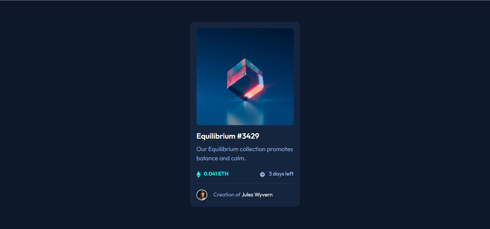
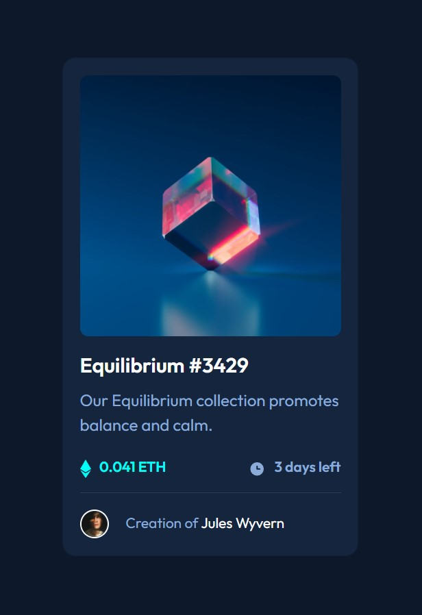

NFT preview card component solution

This is a solution to the NFT preview card component

## Table of contents

- [Overview](#overview)
  - [The challenge](#the-challenge)
  - [Screenshot](#screenshot)
  - [Links](#links)
- [My process](#my-process)
  - [Built with](#built-with)
  - [What I learned](#what-i-learned)
  - [Useful resources](#useful-resources)
- [Author](#author)

## Overview
Hi, this is my attempt to build NFT preview card component. For this technologies I am using are HTML, CSS & Bootstrap.

### The challenge

Users should be able to:

- Try to obtain the below design as close as possible
- View the optimal layout depending on their device's screen size
- See hover states for interactive elements

### Screenshot

Desktop

Mobile

### Links

- Solution URL: (https://your-solution-url.com)
- Live Site URL: (https://your-live-site-url.com)

## My process

### Built with

- Semantic HTML5 markup
- CSS custom properties
- BootStrap Cards

### What I learned

I strengthened my knowledge of HTML5 & CSS through this project. Revisited the concepts and polished them. Building through this project helped me better understand Image Overlays.

### Useful resources

- https://www.w3schools.com/howto/howto_css_image_overlay.asp - This helped me with Image Overlay Icon. This is an amazing article which helped me finally understand Image Overlays. I'd recommend it to anyone still learning this concept.

## Author

- GitHub - https://github.com/Priyanka-Balivada
